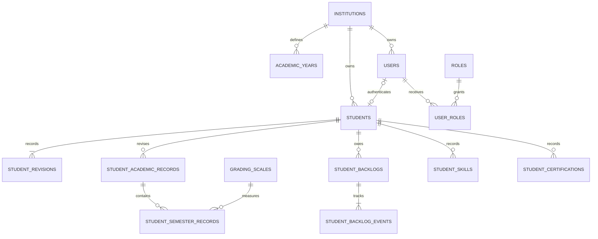
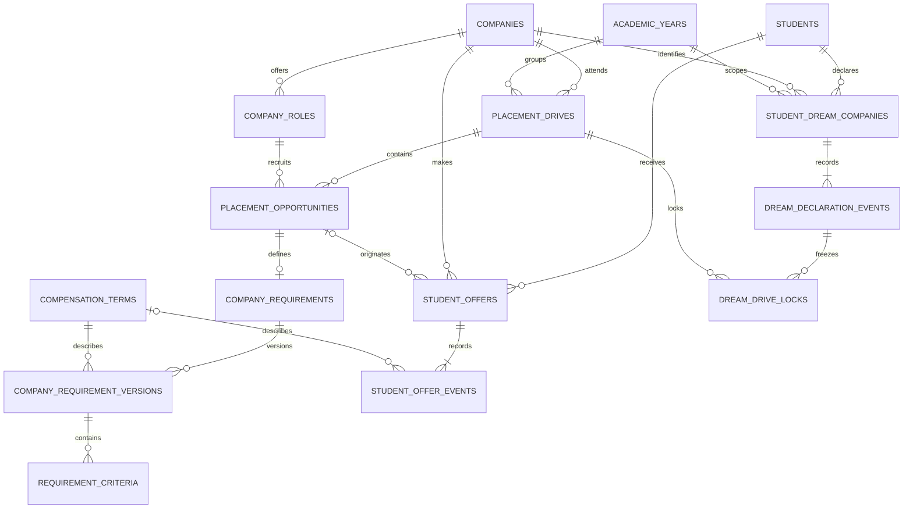
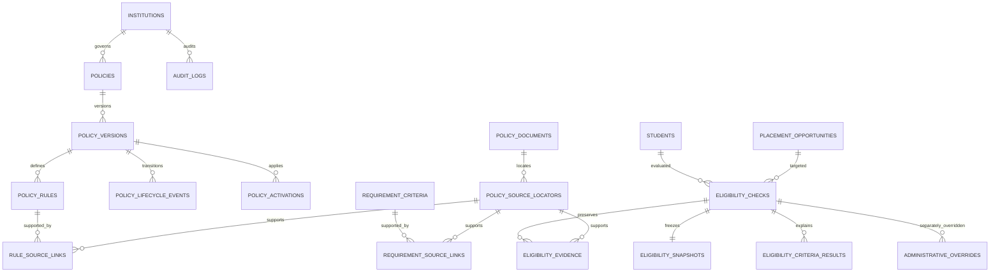

# M2 Domain ERD

Design draft, not an applied schema. See [domain model](../contracts/domain-model.md)
and [confirmed decisions](../contracts/m2-decisions.md). All private relationships
also include institution_id in their physical foreign keys. Reference and event
tables are detailed in the domain model even where omitted here for readability.

## Identity and academics

## Recruitment and placement history

Imported external offers may lack a campus opportunity. Multiple declaration rows
preserve history; initial simultaneous approved cardinality is one. An opportunity's
role and drive must belong to the same company. Locks preserve original cutoffs.

## Policies and decisions

The one-to-one snapshot relationship applies to completed evaluations. Snapshots
freeze values, definitions, versions, offer/declaration history and engine version.
Evidence binds to preserved source originals rather than mutable filename pointers.
